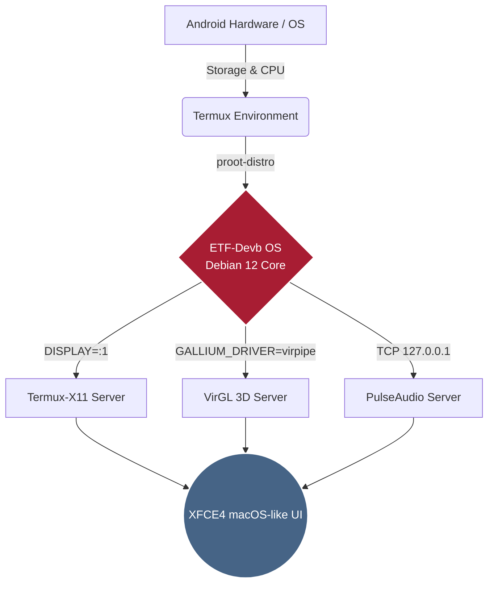

<div align="center">

<!-- Animated Header -->


**Advanced macOS-Inspired Linux Subsystem Environment for Android**

<p align="center">
  
  
  
  
</p>

<p align="center">
  
</p>

<br>

> **"Bridging the gap between Mobile Portability and Desktop Productivity."**
> ETF-Devb OS delivers a fully accelerated, aesthetically refined desktop experience directly on your Android device — powered by X11, PulseAudio, and VirGL for maximum performance.

<br>

<a href="https://github.com/ETF-Devb/ETF-Devb-OS/releases/latest">
  
</a>

</div>

---

## 📑 ❬ TABLE OF CONTENTS ❭

1. [🌟 Key Features](#-key-features)
2. [⚙️ System Requirements](#%EF%B8%8F-system-requirements)
3. [🏗️ Architecture Overview](#%EF%B8%8F-architecture-overview)
4. [📸 System Gallery](#-system-gallery)
5. [📥 Installation Guide](#-installation-guide)
6. [🚀 Execution Protocol](#-execution-protocol)
7. [🛠️ Troubleshooting & Fixes](#%EF%B8%8F-troubleshooting--fixes)
8. [🗑️ Uninstallation](#%EF%B8%8F-uninstallation)

---

## 🌟 ❬ KEY FEATURES ❭

| Feature | Description |
| :---: | :--- |
| 🍏 **macOS-Inspired UI/UX** | Heavily customized XFCE4 desktop with a dock, top panel, and polished icon themes for a premium look and feel |
| 🚀 **Hardware Acceleration** | Native `VirGL` (virpipe) integration to leverage your Android GPU for smooth 3D rendering and window animations |
| 🎵 **Seamless Audio** | Built-in `PulseAudio` server bridging the Linux environment to Android's audio system with near-zero latency |
| 📦 **Out-of-the-Box Ready** | Pre-configured with essential desktop apps, file managers, and network tools — no bloated post-install setup |
| ⚡ **Automated Deployment** | Single-script installer with SHA256 cryptographic checksum verification for guaranteed integrity |

---

## ⚙️ ❬ SYSTEM REQUIREMENTS ❭

ETF-Devb OS is a fully-fledged desktop environment. Ensure your device meets the following specifications before proceeding:

| Requirement | Minimum | Recommended |
| :--- | :--- | :--- |
| **Android Version** | Android 10 | Android 12+ |
| **RAM** | 4 GB | 6 GB or higher |
| **Storage Space** | 8 GB Free | 12 GB Free (UFS / SSD preferred) |
| **Required Apps** | Termux + Termux-X11 | Termux + Termux-X11 (latest builds) |

> ⚠️ The compressed image is approximately **~2 GB** and expands to **~6–8 GB** upon extraction.

---

## 🏗️ ❬ ARCHITECTURE OVERVIEW ❭

Here is a high-level diagram of how ETF-Devb OS is layered on top of Android:



---

## 📸 ❬ SYSTEM GALLERY ❭

<p align="center">
  
  
  
  
  
  
</p>

---

## 📥 ❬ INSTALLATION GUIDE ❭

### `STEP 1` — Environment Setup

Open Termux, update all packages, and grant storage access:

```bash
pkg update && pkg upgrade -y
termux-setup-storage
```

### `STEP 2` — Run the Deployment Script

The automated installer will download the filesystem image, verify its SHA256 checksum, extract the environment, and register the global launch commands:

```bash
curl -sL https://raw.githubusercontent.com/ETF-Devb/ETF-Devb-OS/main/etf-os.sh -o etf-os.sh && chmod +x etf-os.sh && ./etf-os.sh
```

---

## 🚀 ❬ EXECUTION PROTOCOL ❭

After installation, two global shortcuts are available from any Termux session.

### 🌌 GUI Mode — Full Desktop Experience

Launches the complete XFCE4 macOS-like desktop with GPU acceleration and audio:

```bash
etf-gui
```

> ⚠️ **Important:** Open the **Termux-X11** app and leave it running in the background *before* executing this command.

### 🖥️ CLI Mode — Terminal Only

Drops directly into the Debian environment via terminal, with no desktop loaded:

```bash
etf-cli
```

---

## 🛠️ ❬ TROUBLESHOOTING & FIXES ❭

> 💡 For known issues and fixes, please check the [Issues](https://github.com/ETF-Devb/ETF-Devb-OS/issues) page or open a new issue if your problem isn't listed there.

---

## 🗑️ ❬ UNINSTALLATION ❭

To completely remove ETF-Devb OS and all associated shortcuts, run:

```bash
rm -rf $PREFIX/var/lib/proot-distro/installed-rootfs/debian
rm -f $PREFIX/bin/etf-cli $PREFIX/bin/etf-gui
```

---

<div align="center">
  <sub>Built with ❤️ by <a href="https://github.com/ETF-Devb">ETF-Devb</a> · Released under the MIT License</sub>
</div>
