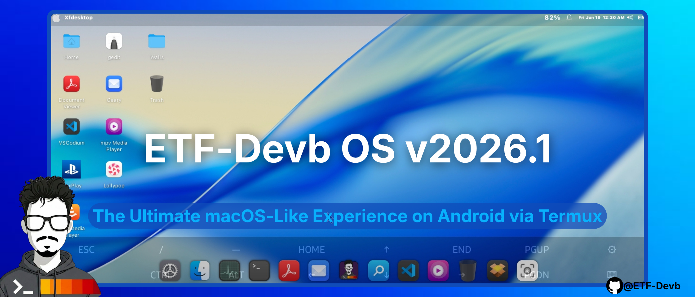
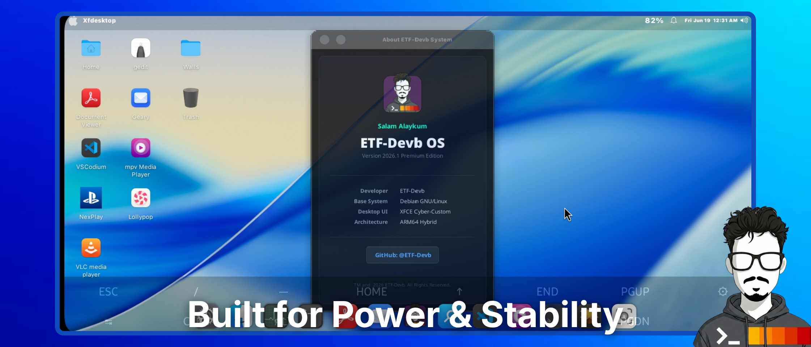
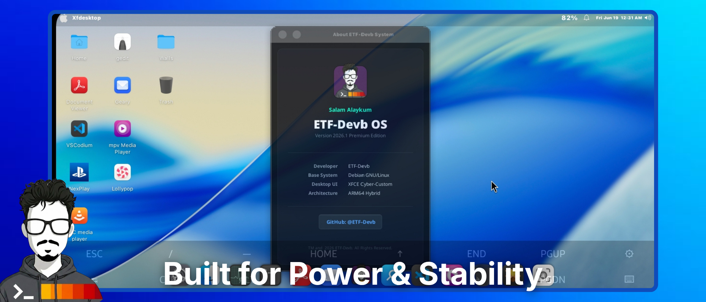
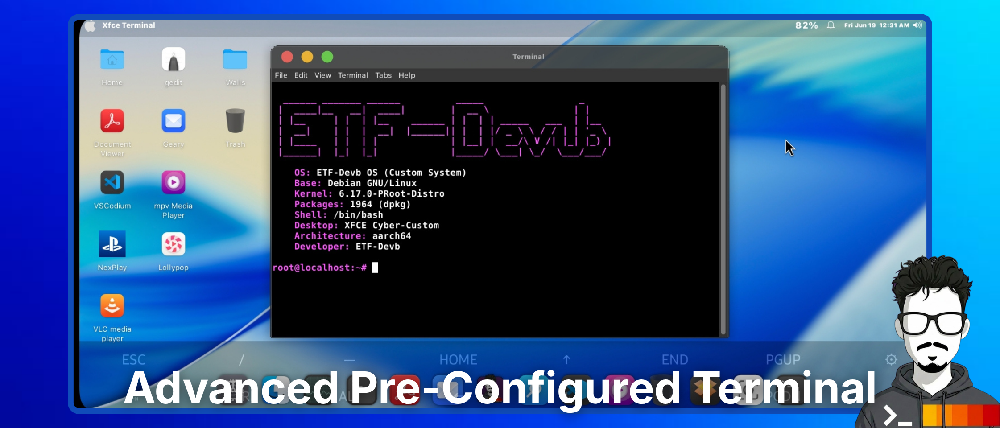
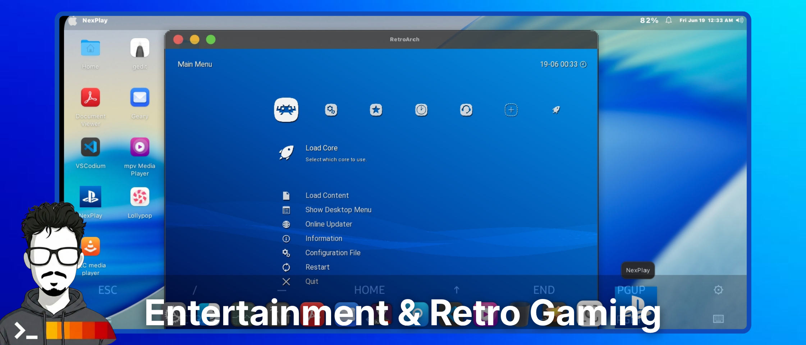
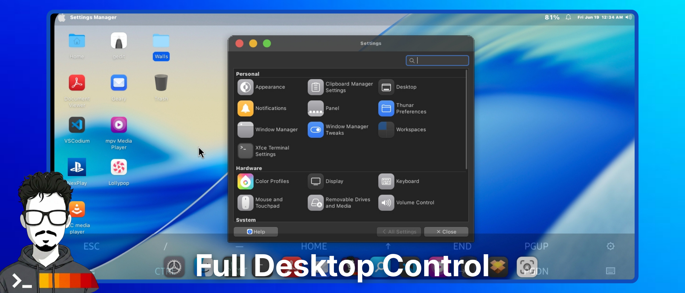

<div align="center">

<!-- Animated Header -->


**Advanced Linux Subsystem Environment for Android**

<p align="center">
  <a href="https://github.com/ETF-Devb/ETF-Devb-OS">
    
  </a>
  <a href="https://github.com/termux/termux-app">
    
  </a>
  <a href="https://xfce.org/">
    
  </a>
  <a href="https://github.com/ETF-Devb/ETF-Devb-OS/releases/latest">
    
  </a>
</p>


<br><br>

> **"Bridging the gap between Mobile Portability and Desktop Productivity."**  
> ETF-Devb OS provides a fully accelerated, macOS-inspired desktop experience directly on your Android device, utilizing X11, PulseAudio, and VirGL for maximum performance.

</div>

<br>

---

## 📸 ❬ SYSTEM_GALLERY ❭

<table align="center" style="border-collapse: collapse; border: none;">
  <tr>
    <td align="center"></td>
    <td align="center"></td>
  </tr>
  <tr>
    <td align="center"></td>
    <td align="center"></td>
  </tr>
  <tr>
    <td align="center"></td>
    <td align="center"></td>
  </tr>
</table>

---

## 📥 ❬ CORE_RESOURCES ❭

To get started, you must download the core image and the required display server infrastructure.

<div align="center">
  
  <a href="https://github.com/ETF-Devb/ETF-Devb-OS/releases/latest">
    
  </a>
  
</div>

> **[ # ] REQUIRED:** Ensure you have installed **Termux** and the **Termux-X11** plugin before proceeding. The core OS image (approx. 2GB) is securely hosted in the official release section.

---

## ⚙️ ❬ INSTALLATION_FLOW ❭

### `STEP 1:` Environment Initialization
Prepare your Termux environment and grant storage permissions.
```bash
pkg update && pkg upgrade -y
termux-setup-storage

```

### `STEP 2:` Automated Deployment

Execute the ETF-Devb automated installer. This script securely fetches the system, verifies cryptographic integrity, extracts the subsystem, and automatically generates your global shortcuts.

```bash
curl -sL [https://raw.githubusercontent.com/ETF-Devb/ETF-Devb-OS/main/etf-os.sh](https://raw.githubusercontent.com/ETF-Devb/ETF-Devb-OS/main/etf-os.sh) -o etf-os.sh
chmod +x etf-os.sh
./etf-os.sh

```

---

## 🚀 ❬ EXECUTION_PROTOCOL ❭

> [!IMPORTANT]
> The automated installer handles all heavy lifting. Post-installation, the system is fully integrated. Use the dynamically generated global commands below to initialize your sessions.

### 🖥️ Option A: CLI Mode (Terminal Only)

For a lightning-fast, pure command-line interface directly within Termux:

```bash
etf-cli

```

### 🌌 Option B: GUI Mode (Full Desktop Experience)

Ignite the full XFCE4 desktop environment, complete with PulseAudio routing and VirGL 3D hardware acceleration:

```bash
etf-gui

```

> ⚠️ **CRITICAL:** Ensure the **Termux-X11 app** is active in the background *before* executing this command.

---

## 🛑 ❬ KILL_SWITCH ❭

**Self-Managing Architecture:**

The environment is engineered for stability. The `etf-gui` session is tightly linked to your display server. Once you safely close the Termux-X11 display app, the built-in Kill Switch automatically hunts down and terminates all background ghost processes (PulseAudio, VirGL, D-Bus), ensuring zero battery drain.
؟
