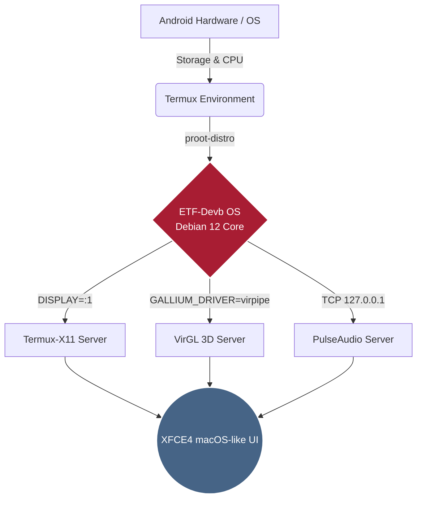

<div align="center">


**Advanced macOS-Inspired Linux Subsystem Environment for Android**

<p align="center">
  
  
  
  
</p>
<p align="center">
  
</p>

<br>

> **"Bridging the gap between Mobile Portability and Desktop Productivity."** > ETF-Devb OS provides a fully accelerated, aesthetically perfected desktop experience directly on your Android device, utilizing X11, PulseAudio, and VirGL for maximum performance.

<br>

<a href="https://github.com/ETF-Devb/ETF-Devb-OS/releases/latest">
  
</a>

</div>

---

## 📑 ❬ TABLE_OF_CONTENTS ❭
1. [🌟 Key Features](#-key-features)
2. [⚙️ System Requirements](#️-system-requirements)
3. [🏗️ Architecture Overview](#️-architecture-overview)
4. [📸 System Gallery](#-system-gallery)
5. [📥 Installation Guide](#-installation-guide)
6. [🚀 Execution Protocol](#-execution-protocol)
7. [🗑️ Uninstallation](#️-uninstallation)

---

## 🌟 ❬ KEY_FEATURES ❭

* **🍏 macOS-Inspired UI/UX:** A heavily customized XFCE4 desktop environment featuring a dock, top panel, and polished icon themes for a premium look and feel.
* **🚀 Hardware Acceleration:** Native integration with `VirGL` (virpipe) to utilize your Android device's GPU for smooth 3D rendering and window transitions.
* **🎵 Seamless Audio:** Built-in `PulseAudio` server bridging the Linux environment with Android's audio system with zero noticeable latency.
* **⚡ Ultra-Fast Parallel Installer:** Re-engineered setup deploying `aria2c` for **16 parallel download streams** (Network Socket Saturation) and multi-core `xz -T0` extraction to eliminate CPU bottlenecks.
* **📊 Low-Overhead Monitoring:** Integrated with `pv` (Pipe Viewer) to compute sub-second decompression progress, data speeds, and precise extraction timeframes without wasting processor cycles.
* **🧹 Automated Environment Purge:** Smarter runtime controller that tracks X11 termination, instantly killing background zombie processes (`pulseaudio`, `proot`, `Xwayland`, `virgl`) upon session exit to preserve your RAM and battery lifecycle.

---

## ⚙️ ❬ SYSTEM_REQUIREMENTS ❭

Because ETF-Devb OS is a fully-fledged desktop environment, please ensure your device meets the following specifications:

| Requirement | Minimum | Recommended |
| :--- | :--- | :--- |
| **Android Version** | Android 10 | Android 12+ |
| **RAM** | 4 GB | 6 GB or higher |
| **Storage Space** | 8 GB Free Space | 12 GB Free Space (SSD/UFS storage) |
| **Required Apps** | Termux & Termux-X11 | Termux & Termux-X11 (Latest builds) |

> ⚠️ *Note: The compressed image is ~2GB, but expands to ~6-8GB upon extraction.*

---

## 🏗️ ❬ ARCHITECTURE_OVERVIEW ❭

Curious how it works under the hood? Here is the flow of ETF-Devb OS:



---

## 📸 ❬ SYSTEM_GALLERY ❭

<p align="center">

  

  

  

  

  

  

</p>
---

## 📥 ❬ INSTALLATION_GUIDE ❭

### `STEP 1:` Environment Setup

Launch Termux, update packages, and grant necessary storage permissions:

```bash
pkg update && pkg upgrade -y
termux-setup-storage

```

### `STEP 2:` Execute Deployment Script

Run the high-performance automated installer pipeline. This triggers multi-threaded downloads, cryptographic SHA256 checksum mapping, and hardware-accelerated rootfs extraction.

```bash
curl -sL [https://raw.githubusercontent.com/ETF-Devb/ETF-Devb-OS/main/etf-os.sh](https://raw.githubusercontent.com/ETF-Devb/ETF-Devb-OS/main/etf-os.sh) -o etf-os.sh && chmod +x etf-os.sh && ./etf-os.sh

```

---

## 🚀 ❬ EXECUTION_PROTOCOL ❭

The installer automatically compiles and generates global system utilities inside your environment path (`$PREFIX/bin`) for immediate invocation.

### 🌌 Full Desktop Experience (GUI Mode)

To boot into the full XFCE4 macOS-like desktop configuration with complete sound routing and hardware-accelerated rendering:

```bash
etf-gui

```

> ⚠️ **CRITICAL:** You must open the **Termux-X11** app in the background *before* executing this utility.
> 💡 *Note: Closing the X11 app automatically triggers a background purge daemon that isolates and cleans all hanging subsystem servers.*

### 🖥️ Pure Terminal (CLI Mode)

If you only need immediate headless access to the Debian core layer directly through the standard CLI console:

```bash
etf-cli

```

### 🚨 Manual Subsystem Purge (Emergency Tool)

If your desktop layout freezes or a sound socket locks up in the background, you can force-reclaim 100% of your system resources globally via an isolated session terminal:

```bash
stop_env.sh

```

---

## 🗑️ ❬ UNINSTALLATION ❭

Need to wipe the system and free up device memory storage? You can completely wipe the subsystem layer along with its custom shortcut maps by running:

```bash
rm -rf $PREFIX/var/lib/proot-distro/installed-rootfs/debian
rm -f $PREFIX/bin/etf-cli $PREFIX/bin/etf-gui $PREFIX/bin/stop_env.sh

```
